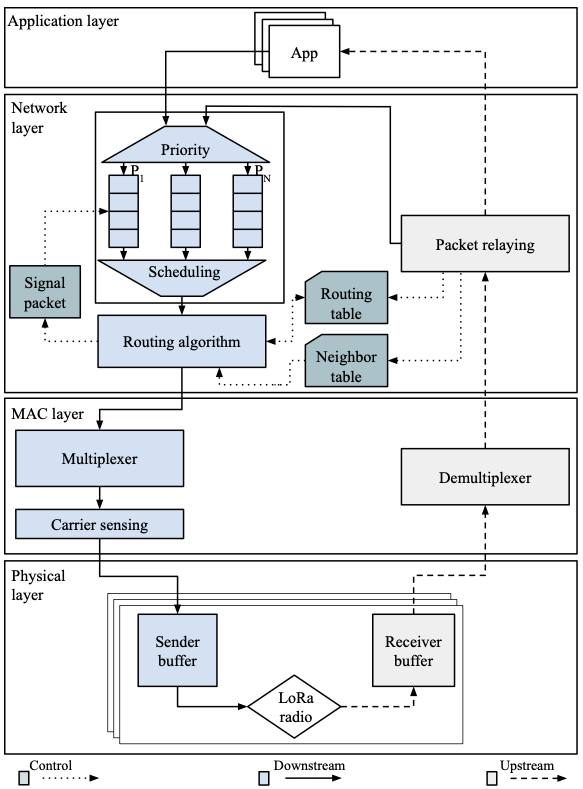
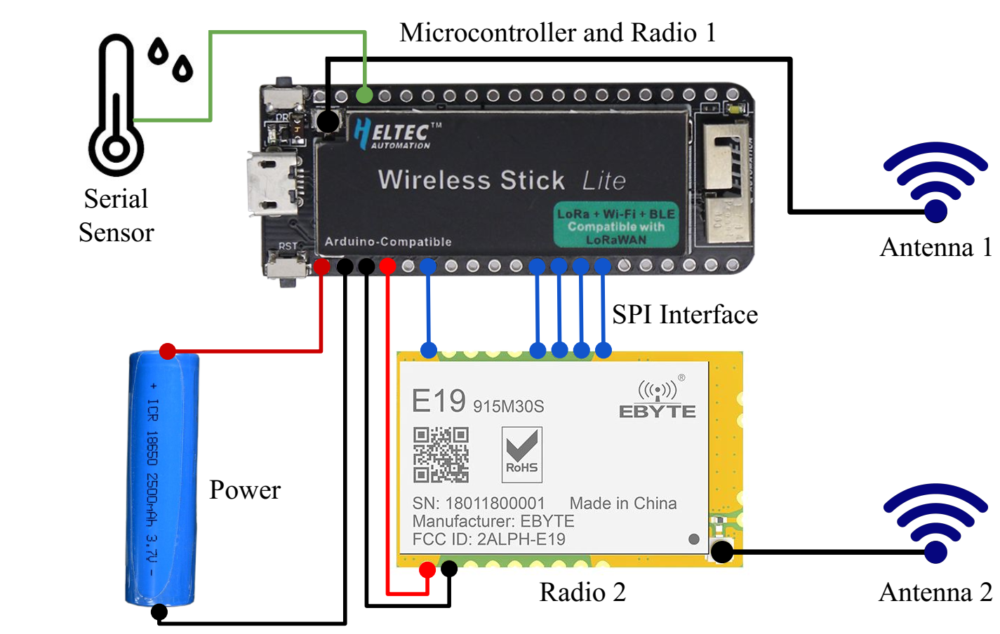

## Multi-LoRa

Agriculture plays vital importance in developing an agricultural country, where rural modernization emerges as a solution to improve farming, field, and producers' issues. Multi-LoRa is a multi-radio and multi-hop LoRa communication architecture to increase the coverage and service for large-scale IoT deployment in rural areas. In this case, Multi-LoRa provides a reference for implementing communication networks based on the physical layer LoRa.

## Multi-LoRa Architecture

The Multi-LoRa architecture provides a reference model for implementing multi-radio and multi-hop LoRa communication for large-scale IoT deployment in rural areas. Multi-LoRa architecture consists of four layers: Physical, MAC, Network, and Application, as shown the figure below. Specifically, the Physical layer considers the LoRa® radio provided by Semtech. For upper layers, there are some expected features. For instance, the MAC layer must ensure an efficient  transmission scheme over multiple radios. Furthermore, the Network layer is responsible for forwarding the routing data to route the data with lower signaling overhead and half-duplex communication. Finally, IoT applications can be built at the Application layer. In the following, we describe each layer of our architecture.

     

## Multi-LoRa Prototype

We developed a hardware prototype for physically implementing the Multi-LoRa architecture consists of hardware and software implementation, as shown in figure below. Each node shares the same hardware structure and main firmware. In terms of hardware implementation, each node is composed of an Espressif Esp32 microcontroller (dual-core 32-bit LX6 microprocessor, operating at 240 MHz and performing at up to 600 DMIPS, Ultra-Low-Power co-processor, 520 KB SRAM, 448 KB ROM), two LoRa radios SX1276, and energy source with a capacity of 2100 mAh. We implemented the MAC, routing, and application layer protocols on device firmware using the C programming language in software implementation. Specifically, we implemented the LBT communication model at the MAC layer, the Babel routing protocol (RFC8966) at the network layer, and Modbus at the application layer. 

     

## Main dependencies

## First steps

## Build and installation

## How to Test

## Main results

What You Need
Hardware:
- An ESP32 board
- SX1276 module
- USB cable - USB A / micro USB B
- Computer running Linux

Software:
ESP-IDF that essentially contains API (software libraries and source code) for ESP32 and scripts to operate the Toolchain
