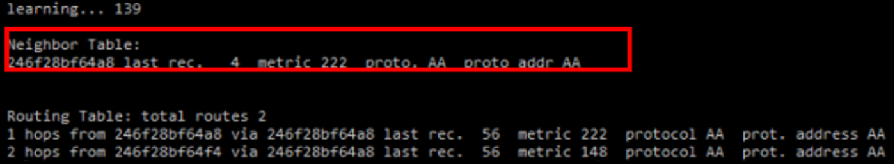
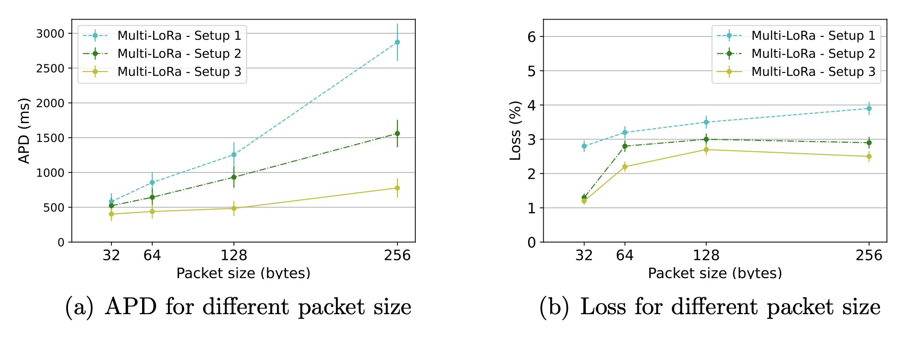
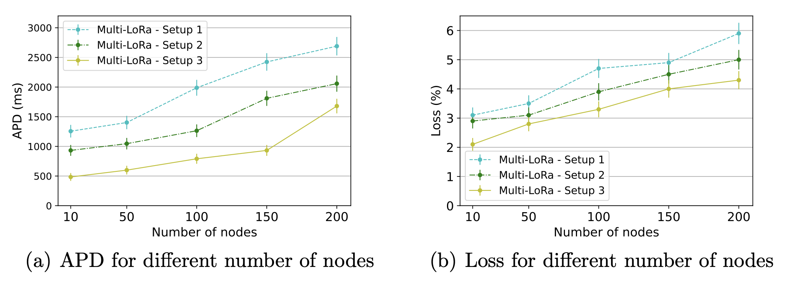

## Multi-LoRa - Multi-radio and Multi-hop LoRa Communication Architecture for Large Scale IoT Deployment

<p align="justify">
Agriculture plays vital importance in developing an agricultural country, where rural modernization emerges as a solution to improve farming, field, and producers' issues. Multi-LoRa is a multi-radio and multi-hop LoRa communication architecture to increase the coverage and service for large-scale IoT deployment in rural areas. In this case, Multi-LoRa provides a reference for implementing communication networks based on the physical layer LoRa.
</p>

## Multi-LoRa architecture

<p align="justify">
The Multi-LoRa architecture provides a reference model for implementing multi-radio and multi-hop LoRa communication for large-scale IoT deployment in rural areas. Multi-LoRa architecture consists of four layers: Physical, MAC, Network, and Application, as shown in the figure below. Specifically, the Physical layer considers the LoRa® radio provided by Semtech. For upper layers, there are some expected features. For instance, the MAC layer must ensure an efficient transmission scheme over multiple radios. Furthermore, the Network layer is responsible for forwarding the routing data to route the data with lower signaling overhead and half-duplex communication. Finally, IoT applications can be built at the Application layer. In the following, we describe each layer of our architecture.
</p>

<p align="center">
     
</p>

## Multi-LoRa prototype

<p align="justify">
As shown in the figure below, we developed a hardware prototype for physically implementing the Multi-LoRa architecture consisting of hardware and software implementation. Each node shares the same hardware structure and main firmware. In terms of hardware implementation, each node is composed of an Espressif Esp32 microcontroller (dual-core 32-bit LX6 microprocessor, operating at 240 MHz and performing at up to 600 DMIPS, Ultra-Low-Power co-processor, 520 KB SRAM, 448 KB ROM), two LoRa radios SX1276, and energy source with a capacity of 2100 mAh. We implemented the MAC, routing, and application layer protocols on device firmware using the C programming language in software implementation. Specifically, we implemented the LBT communication model at the MAC layer, the Babel routing protocol (RFC8966) at the network layer, and Modbus at the application layer. 
</p>

<p align="center">
     
</p>

## Main dependencies

### The minimum hardware requirement and software to run this experiment in bare metal (microcontroller) are:
Hardware:
- 4 Heltech Wireless Stick Lite (ESP32+SX1272) board
- 4 SX1276 module
- 4 USB cable - USB A / micro USB B
- Computer running Debian Linux
- ESP-IDF that essentially contains API (software libraries and source code) for ESP32 and scripts to operate the Toolchain

Software:
- ESP-IDF that essentially contains API (software libraries and source code) for ESP32 and scripts to operate the Toolchain

### The minimum hardware requirement and software to run this experiment in simulation mode are:
Hardware:
- Computer with 32GB RAM running Debian Linux

Software:
- Python 3.6 and libs in requeriments.txt
- gcc compiler an pthread lib


## First steps Hardware Prototype

You need to install some software packages on Debian Linux to use the ESP-IDF cross-compiler with the Hardware prototype.

### Build and installation

1 - You need to get the following packages to compile prototype bare-metal firmware using ESP-IDF. 

```
sudo apt-get install git wget flex bison gperf python3 python3-pip python3-setuptools cmake ninja-build ccache libffi-dev libssl-dev dfu-util libusb-1.0-0
```

2 - You need the software libraries provided by Espressif in the ESP-IDF repository to build applications for the prototype.  To get ESP-IDF, navigate to your installation directory and clone the repository with git clone, following instructions.

Open Terminal and run the following commands:
```
mkdir -p ~/esp
cd ~/esp
git clone --recursive https://github.com/espressif/esp-idf.git
```
3 - You also need to install the tools used by ESP-IDF for projects supporting ESP32, such as the compiler, debugger, Python packages, etc.
```
cd ~/esp/esp-idf
./install.sh esp32
```

4 - The installed tools are not added to the PATH environment variable yet. You must set some environment variables to make the tools usable from the command line. ESP-IDF provides a script that does that.

In the terminal where you are going to use ESP-IDF, run:
```
. $HOME/esp/esp-idf/export.sh
```
5 - Now, you are ready to prepare your application for the prototype. You can start cloning the project.
```
  git clone https://github.com/luciorp/multi-lora.git
  
  cd multi-lora
```
6 - Build the project by running:

```
idf.py build
```
This command compiles the application and all ESP-IDF components and generates the bootloader, partition table, and application binaries.
```
$ idf.py build
Running cmake in directory /path/to/multi-lora/build
Executing "cmake -G Ninja --warn-uninitialized /path/to/multi-lora"...
Warn about uninitialized values.
-- Found Git: /usr/bin/git (found version "2.17.0")
-- Building empty aws_iot component due to configuration
-- Component names: ...
-- Component paths: ...

... (more lines of build system output)

[527/527] Generating multi-lora.bin
esptool.py v2.3.1

Project build complete. To flash, run this command:
../../../components/esptool_py/esptool/esptool.py -p (PORT) -b 921600 write_flash --flash_mode dio --flash_size detect --flash_freq 40m 0x10000 build/multi-lora.bin  build 0x1000 build/bootloader/bootloader.bin 0x8000 build/partition_table/partition-table.bin
or run 'idf.py -p PORT flash'
```

6 - Flash the binaries that you just built (bootloader.bin, partition-table.bin, and multi-lora.bin) onto your prototype board by running:

```
idf.py -p PORT [-b BAUD] flash
```
Replace PORT with your ESP32 board’s serial port name.

### How to test

You will see the output log similar when flashing firmware in the prototype:
```
esptool.py --chip esp32 -p /dev/ttyUSB0 -b 460800 --before=default_reset --after=hard_reset write_flash --flash_mode dio --flash_freq 40m --flash_size 2MB 0x8000 partition_table/partition-table.bin 0x1000 bootloader/bootloader.bin 0x10000 hello_world.bin
esptool.py v3.0-dev
Serial port /dev/ttyUSB0
Connecting........_
Chip is ESP32D0WDQ6 (revision 0)
Features: WiFi, BT, Dual Core, Coding Scheme None
Crystal is 40MHz
MAC: 24:0a:c4:15:b7:18
Uploading stub...
Running stub...
Stub running...
Changing baud rate to 460800
Changed.
Configuring flash size...
Compressed 3072 bytes to 103...
Writing at 0x00008000... (100 %)
Wrote 3072 bytes (103 compressed) at 0x00008000 in 0.0 seconds (effective 5962.8 kbit/s)...
Hash of data verified.
Compressed 26096 bytes to 15408...
Writing at 0x00001000... (100 %)
Wrote 26096 bytes (15408 compressed) at 0x00001000 in 0.4 seconds (effective 546.7 kbit/s)...
Hash of data verified.
Compressed 147104 bytes to 77364...
Writing at 0x00010000... (20 %)
Writing at 0x00014000... (40 %)
Writing at 0x00018000... (60 %)
Writing at 0x0001c000... (80 %)
Writing at 0x00020000... (100 %)
Wrote 147104 bytes (77364 compressed) at 0x00010000 in 1.9 seconds (effective 615.5 kbit/s)...
Hash of data verified.

Leaving...
Hard resetting via RTS pin...
Done
```
<p align="justify">
To check if Multi-LoRa firmware is indeed running, type idf.py -p PORT monitor (replace PORT with your serial port name).
The firmware's default configuration generates random traffic to all nodes in the routing table. 
</p>
<p align="center">
     
</p>


## First steps Simulation

You need to install some software packages on Debian Linux to use the simulator, such as make, gcc, and python 3 with their libraries.

### Build and installation

Install the gcc compiler and make to compile firmware on x86_64 architecture and make simulation possible.
```
sudo apt-get -y install make build-essential
```
Install the python interpreter to run the mesh network simulator.
```
sudo apt install -y python3 python3-pip libssl-dev libffi-dev python3-dev python3-venv
```
Now, you are ready to prepare your emulation/simulation. You can start the clone of the project.
```
  git clone https://github.com/luciorp/multi-lora.git
  
  cd multi-lora/simulator
```
Build the firmware to emulate on x86_64 architecture by running make all inside the folder multi-lora/simulator/mac_sim

Back to the multi-lora/simulator/ folder and install the necessary libraries to run the python simulator
```
pip3 install -r requirements.txt
```
### How to test

You need to configure the topology.csv file with the distribution of nodes in space to run the python simulator.

```
NodeId,Xcoord,Ycoord,Address
nodeA,   0,     0,    10
nodeB,   0,     4,    20
nodeC,   0,     8,    30
nodeD,   4,     0,    40
nodeE,   4,     4,    50
nodeF,   4,     8,    60
nodeG,   8,     0,    70
nodeH,   8,     4,    80
nodeI,   8,     8,    90
```

Configure the packets.csv file to indicate the packets to be sent with the source node address, destination node address, payload (hexadecimal), 
and the time in ms.

```
pktID, srcAddre, destAddr, startTime, dataPayload
  1,      10,       90,        10,        AABBCCDDEEFF112233445566778899
  2,      10,       80,        3000,      AABBCCDDEEFF112233
  3,      10,       50,        6000,      AABBCCDDEEFF112233445566778899ABCDEFABCDEF

```
<p align="justify">
You must have the firmware compiled to start the simulation.
The simulator will launch Linux processes with the binary compiled from the firmware.
It also emulates the physical medium, indicating the airtime of each packet and indicating which nodes are in range to send, based on the topology.csv file.
Each simulation cycle is equivalent to 1 ms and based on that time, the packets listed in the packets.csv file are sent.
</p>
Start simulation.

```
python3 simulator.py
```

The results are listed in the results.csv file at the end of the simulation process.

```
pktID, srcAddre, destAddr, totalTime, timeout, dataError
  1,      10,       90,        63,       0,      0
  2,      10,       80,        42,       0,      0
  3,      10,       50,        87,       0,      0

```

## Main results

<p align="justify">
We evaluated the Multi-LoRa prototype considering two approaches: a small-scale based on a physical testbed and a large-scale using a simulation environment. The testbed results are investigated to calibrate the simulation experiments and analyze the performance of Multi-LoRa in real experiments. Moreover, the simulation experiments evaluated Multi-LoRa concerning delay and data delivery in a large-scale scenario. Furthermore, it is necessary to highlight that our simulation used the same source code prototyped in the testbed.
</p>

<p align="justify">
The figure below shows the delay for transmitting packets with different sizes considering three Multi-LoRa setups in the testbed environment. The delay results show that Average Packet Delay (APD) increases as soon as the packet size increases for transmitting data over Setup 1. Moreover, multi-radio architecture, i.e., Setup 2 and Setup 3 of Multi-LoRa, increases the APD lower than single-radio architecture for larger packet sizes. The weak performance of single-radio architecture is due to the half-duplex nature of the LoRa radio, where the queuing time on each hop is higher. For instance, packets with 256 bytes have APD 495% higher than the packet size of 32 bytes by transmitting the packet over Setup 1. We divide each data packet into two small packets to transmit over each radio on Setup 2 and Setup 3, reducing the transmission time. Finally, it is possible to conclude that Setup 3 provides lower APD regardless of the packet size compared to the other architectures. It considers packet transmission over multiple radios to mitigate the half-duplex nature of the LoRa radio, and the BW value of 250 kHz helps reduce APD.
</p>

<p align="center">
     
</p>
    
<p align="justify">
The figure below shows APD for several IoT nodes considering three Multi-LoRa setups in the simulation environment. The APD results for large scale-scenario show that Setup 3 provides APD 61.5% and 26% lower than Setup 1 and Setup 2. This behavior happens because Setup 3 considers a multi-radio transmission with a better radio configuration (i.e., BW and SF values). For instance, the packet with a payload of 128 bytes transmitted with SF 7 and BW of 125 kHz has a ToA value of 332.03 ms, while SF 7 and BW of 250 kHz has a ToA average value of 166.02 ms. This result explains why the APD performance of Multi-LoRa - Setup 3 is 50% better than Setup 2. Finally, Setup 2 provides APD results 75% better than Setup 1 since Setup 2 considers two LoRa radios for transmitting data, reducing the effects of a half-duplex nature of the LoRa radio.
</p>

<p align="center">
     
</p>

## How to cite

@article{PRADE2022108242,
author = {Lucio Prade and Jean Moraes and Eliel {de Albuquerque} and Denis Rosário and Cristiano Bonato Both},
title = {Multi-radio and multi-hop LoRa communication architecture for large scale IoT deployment},
journal = {Computers and Electrical Engineering},
volume = {102},
pages = {108242},
year = {2022},
issn = {0045-7906},
doi = {https://doi.org/10.1016/j.compeleceng.2022.108242}.
}

